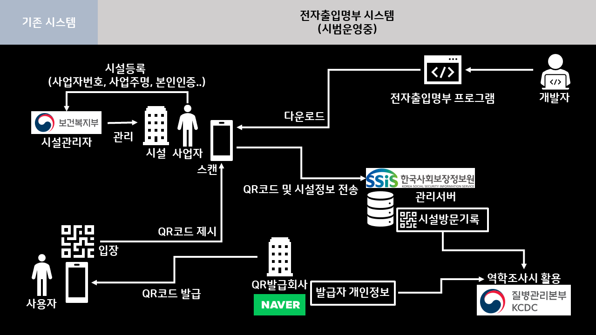
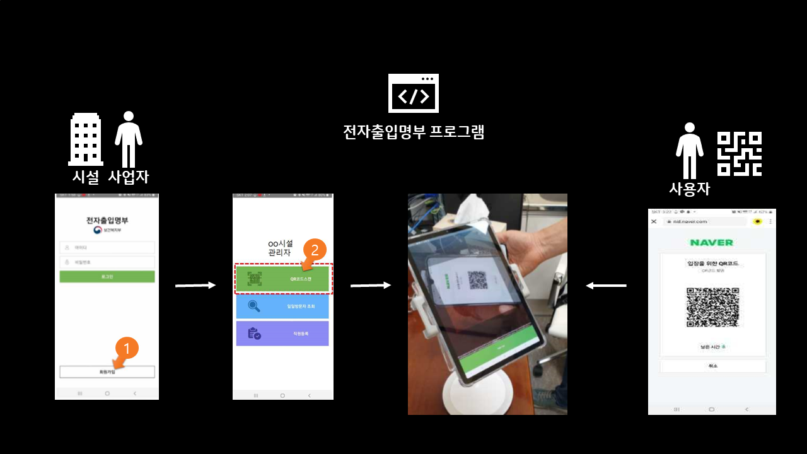
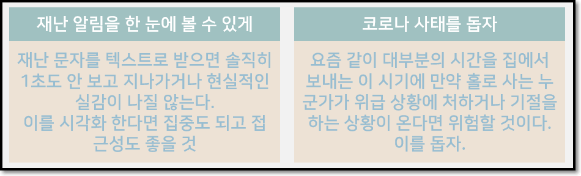

# Project.2020-CALL-FOR-CODE 👩‍💻👨‍💻

### [Save Our Signal] "지능형 ANTI-COVID19 전자 출입 기록 및 시각화 시스템"

## 0. PROJECT INTRO

- 프로젝트 구성원 : [이민형](https://github.com/MinHyungRHIE), [박찬형](https://github.com/ch-4ml), [김경훈](https://github.com/ngngman), [이혜은](https://github.com/AliceHELee), [윤경호](https://github.com/zoomspeed)
- 프로젝트 일정
  - 해커톤 일정<br>
    

## 1. WHY : 본 프로젝트가 왜 의미가 있는가

### 기존 시스템 [전자출입명부 시스템]

#### 왜 등장 했는가

- COIVD19 확산의 방지 및 방역조치를 위해 그간 수기로 출입자 명부를 작성해 옴
- 출입자 명부가 허위 작성되는 등의 문제점 발견
- 출입자 명부를 QR코드 기반의 시스템을 구축해 개선<br>

<br>

#### 시범사업 시작

- 시설관리자용으로 앱설치는 2020년 6월 10일 이후 설치 가능할 것<br>

<br>

#### 문제점

- **정부 입장**에서는 COVID19 확진자 발생시 역학조사에 효과적으로 사용할 수 있으나, 사용자나 사업자 입장에서는 전혀 경제적 득이 없음.
- **(사업자 입장)** 고객들에게 협조를 요구하는 과정에서 고객 유치 문제를 생각할 수 밖에 없음
- **(사용자 입장)** 자발적으로 참여하는 사용자와 참여하지 않은 사용자 간의 차이가 없음
- *현재 상황*으로는 `개인정보`를 취급하는 1개의 QR발급 회사와 `시설방문기록`을 보관하는 1개의 관리 서버로 안정성과 보안성에 대한 보증 수단이 더 필요함. 게다가 평시 `개인정보`와 `방문기록`을 NAVER 등의 QR발급회사와 사회보장정보원에 분산 보관하다가 필요시에만 결합을 하는데 이 때 결합한 정보에 대한 무결성을 증명해주는 **서드파티**가 더 필요할 것으로 보임
- **정부**는 모든 업소(시설)에 본(전자출입명부) 시스템을 적용하는 것이 아니라 `공간의 밀폐정도`,`이용자간 밀집정도`,`공간 이용자의 규모`, `비말 발생 가능성`,`이용자의 체류 시간`, `방역 수칙 준수 곤란 여부`의 평가지표를 이용해 시설의 위험도를 평가하고 특히 `고위험시설`(일반음식점, 유흥주점, 단란주점, 콜라텍, 노래연습장, 실내체육시설, 스탠딩공연장)들을 **의무시설**로 지정하여 반드시 적용시키고 그게 아닌 **임의시설**은 권고 및 자발적으로 적용하는 시설로 나눔.

  - 문제는 반드시 적용되는 **의무시설**과 달리 **임의시설**이 자발적으로 참여하는 경우가 현저히 떨어질 것으로 판단됨(이익이 없음)
  - **시설을 평가하는 자원은 한정되어 있기 때문**에 사용자나 사업자들이 자발적으로 참여하는 사회 분위기를 형성해야 COVID19 확산을 더욱 효과적으로 막을 수 있고 본 시스템의 효용성이 더 증가할 것임

  <br>

<br>

### Save Our Signal팀의 제안 및 기대 효과

- 실질적으로 도움이 되는 서비스를 추가해 상용성과 범용성 확대
- 국민들에게 이익이 되어 자발적으로 참여를 이끄는 시스템
- 차세대 기술로 IT 기술 활용 효율성을 비약적으로 증대

|                                                                                                                                                                           국민 편의 서비스                                                                                                                                                                           |
| :------------------------------------------------------------------------------------------------------------------------------------------------------------------------------------------------------------------------------------------------------------------------------------------------------------------------------------------------------------------: |
|                      `안심 업소 인증` : 업소들이 정부가 설치하길 바라는 온도 측정기 등의 COVID19 의심 환자 측정 IoT 기기 및 진단 도구들을 도입하게 되면 그만큼 자본금이 들게 된다. 정보의 권고에 따라 자발적으로 공익을 창출하는 기업에 대해 **안심업소**라는 타이틀을 주어 사용자들이 안심하고 이용할 수 있는 시설임을 정부가 보증해줘야 한다.                      |
| `시설 인원 관리` : **기업** 직원들의 출퇴근 인원 관리, **학원**의 수강생들의 출석 인원 관리, **자영업소**의 유동 손님 관리 등 시설관리자들이 처한 환경에 따라 다양하게 쓰일 수 있는 기능이며, 특히 온라인 선착순 예약제는 사회적 거리두기가 쉽게 이뤄지지 않는 줄서기 등을 해결해 줄 것이다. 게다가 _인공지능_ 기술로 예상 대기 시간을 계산하여 사용자에게 제공한다. |
|         `제휴 포인트` : 사용자들이 자발적으로 QR코드 스캔에 참여시키기 위한 수단이다. 입장할 때 QR코드로 찍고 들어가고 다시 퇴장할 때, 서비스 이용 금액에 비례하여 **네이버페이**나 **제로페이**에 포인트를 쌓게 하면 자발적 참여가 높아질 것이고, 포인트가 서비스 이용 금액에 따라 비례하니 서비스 판매자들의 매출 효과에도 긍정적으로 영향을 미칠 것이다.          |
|           `온라인 예약 및 출석` : 온라인으로 식당을 예약하거나 학원에 출석하여 직접 가서 기다리는 수고를 덜고 수기로 작성해야 하는 불편을 덜 수 있다. 게다가 각 업소별로 `안신 업소 인증` 마크 여부를 확인하고 현재 들어가 있는 인원들과 수용 한계 인원들을 비교 분석해 밀집 정도를 예상하여 COVID19 확산을 최대한 피할 수 있는 경로를 스스로 짤 수 있다.            |

<br>

|                                                                                                기관 보호/효율 서비스                                                                                                 |
| :------------------------------------------------------------------------------------------------------------------------------------------------------------------------------------------------------------------: |
|                                            `블록체인` 기술을 이용해 민감한 데이터 정보에 대한 보호를 강화시키고, `인공지능` 기술을 이용하여 업무 효율성을 높여줄 수 있다.                                            |
| **블록체인 활용의 예**로 질병관리본부(KCDC)가 관리서버와 발급회사에게 정보를 요구할 때 이 두 노드(Node)로부터 나와 합쳐진 정보가 위조 및 변경이 이루어 졌는지 데이터 무결성 체크를 해줘 데이터 신뢰성을 더욱 높인다. |
|     **인공지능 활용의 예**로 질병관리본부가 역학조사를 할 때 체류시간, 밀집도, 업소특징 등의 데이터들을 학습해 어떠한 데이터 특성이 COVID19 확진 위험이 높은지 예측해줘 정부 정책 수행에 크게 도움을 줄 것이다.      |

<br>

<br>

- `지금 문제는 속도다!`
- 한시라도 빨리 포스트 코로나 시대를 효과적을 준비하고 대비해야 하는 촌각을 다투는 이 민감한 시기에 빠른 속도로 도움이 되는 어플리케이션을 배포하는 것이 중요함
- 이미 시범사업을 막 시작한 `전자출입명부` 프로그램이 존재하고 새로운 어플을리케이션을 만들어 교체하는 것 보단 기존 어플리케이션을 개선하여 나아가는 것이 중요함
- 즉, 본 SOS(Save Our Signal)팀이 제시한 위 지능형 서비스들을 API로 제공하여 전자출입명부 프로그램을 더욱 빠르게 효과적으로 업그레이드 시키고 후속으로 나오는 어플리케이션에 대해서도 기능을 제공할 수 있어 COVID19를 대응하는 개선된 개발환경을 기대

<br>

<br>

- 기존의 기능 `QR코드스캔`과 `일일방문자 조회`, 그리고 `직원등록` 서비스 뿐만아니라 인공지능과 블록체인 기반의 지능형 서비스를 제공해 지능형 ANTI-COVID19 전자 출입 기록 및 시각화 시스템을 제안함

<br>

### 본 서비스 상용화로 얻어질 효과

- 인간은 본래 이기적이고 이익을 추구하나 이를 좋은 방향으로 이끈다면 좋은 사회로 자발적인 이끌 수 있음
- 차세대 ANTI-COVID19 시스템으로 대외적으로 홍보할 수 있음

<br>

<br>

## 2. HOW : 어떻게 만들 생각인가

- 기존의 시스템을 활용하기엔 우선 QR코드가 암호화되어 있어 안에 어떠한 데이터로 구성되어 있는지 파악할 수 없다. 게다가 사업자 등록증과 시설 등록 또한 이루어져야 하기에 어려움이 있음

- 때문에 시연을 위한 COPY 페이지를 구성할 것
  <br>

<br>

- 핵심 적인 기능으로 우선 업소별 실시간 수용 인원, 현재 인원, 대기인원을 나타내고 예상 대기 시간, 예약 및 예약 취소 기능 등을 한 눈에 볼 수 있게 구성할 것

- 예상 대기 시간은 API로 부터 예측 데이터를 전송 받을 것
  <br>

<br>

- 지속적으로 창조되고 개선될 아이디어 들을 기록하여 킬러 서비스를 만드는데 노력할 것

<br>

<br>

## 3. WHAT : 그래서 우리가 만든 결과물은

-

## 4. 마무리하면서

-

<hr>
<hr>

# Activity Histroy

분위기 :
**Good**🟥🟧🟨🟩🟦🟪🟫**Bad**

### 🟨2020년 4월 23일(목)

- 서울시-한국IBM 온라인 해커톤 개최 소식을 접함 :
  [관련 소식](https://blog.naver.com/quotia72/221923628554)
- 팀원 구성 완료 (5명)
- 상호간 소개 및 인사 후 아이디어 논의 + 지금까지의 Call for Code 해커톤 수상작 및 Sample들을 살펴봄
- 코로나19와 환경문제에 대한 해결책 및 기존에 이미 존재하는 서비스들을 확인하며 개선해야 되는 부분이 있는지 긴 시간 토의함

### 🟩2020년 5월 8일(금)

- 첫 대면 미팅 진행 ( 장소 : _아주대 산학협력원_, **저녁 6시** )
  - 모임자 : 이민형, 박찬형, 김경훈, 이혜은 ( 윤경호는 회사 일로 바뻐서 아이디어 참가가 힘드므로 후에 설계가 나오고 기획이 세워지면 Front-End 개발 전 영역을 맡아주기로 함)
- 아이디어 회의 진행<br>
  

### 🟩2020년 5월 10일(일)

- 저녁 8시 50분, Google meet 화상 회의 진행 -> **아이디어 회의**

### 🟦2020년 5월 11일(월)

- 저녁 8시, Google meet 화상 회의 진행 -> **아이디어 회의**
- 아래 그림은 **5월 10일**, **5월 11일** 논의하면서 나온 쓸만한 아이디어 소스<br>
  

### 🟪2020년 5월 12일(화)

- !!! 오늘만은 꼭 아이디어를 정하자 !!! 제발...😭
- 저녁 8시 50분, Google meet 화상 회의 진행 -> **아이디어 회의**
- 결국 아이디어 못정함. 일단 참가 신청이라도 해야하니 우선 모든 아이디어를 적어보기로 함

### 🟪2020년 5월 13일(수)

- 해커톤 참가 신청 완료

```
<프로젝트 요약 및 아이디어>

위기의 지구를 구하는 Call for Code의 부름에 응답하기 위하여 저희 팀의 아이디어 후보는
1. 재난과 질병에 맞선 분들을 위한 신뢰 기반의 명예의 전당을 세워 그들을 위한 물자와 지원
2. 재난과 질병의 시각화 지도로 한눈에 볼 수 있게 하고 밀집 지역 회피를 위한 정보 제공
3. 재난 신호 서비스 : 119신고와 주변의 도움 요청을 통해 골든 타임 사수
4. 재활용 처리 현황 공유로 환경 경각심 유도 및 인공지능 개발을 통한 분리방법 안내시스템
```

### 🟩 온라인 교육 세션 진행(총 3 회)

<br>

- 1회차 내용 정리

```
1. IBM Cloud를 개인적으로 만들어야 하군요. 무료 서비스만으로도 충분할 것 같습니다.
2. "IBM의 서비스가 많으니 그걸 활용하라 0부터 만들기엔 시간이 없고, 그런걸 원하는 것도 아니다."
3. 지금까지 우승팀은 IoT팀(그러기에 우리는 모바일을 활용해 무언갈 하는 아이디어였으면 좋겠다)
4. 아이디어를 완전히 구현할 필요는 없고(시간이 부족) 어떻게 돌아가는지 DEMO 형식으로 보여주어 혁신성과 상용성 집중
5. Node-red 등의 IBM에서 제시한 기술 파악 필요 + Start Kit도 돌려봐야 할듯

[정리 한 줄]
IBM이 제시한 문제와 사례 기반으로 개발하면 좋곘고, 이미 관련 서비스가 있더라도 개선하는 방향으로 나아 갔으면 좋겠다.
```

- 2회차 내용 정리

```
코로나와 기후변화가 관계가 있다고 한다. 자가격리로 이동이 줄면서 환경이 크게 개선되었다는 것. 즉, 이동의 양을 줄이자.
인센티브가 필환경시대에서 참여를 유도할 것으로 보인다.
생산부터 재활용까지 기업이 책임지는 사례가 증가했으면 좋겠다.
시민 + 기업 + 정부 = 환경 문제 해결의 기본
```

- 3회차 내용 정리

```
저탄소 사회로의 전환, 기후변화 체계 확립(구체제: 교토의 정서, 새천년개발목표(MDGs) / 신체제: 파리협정, 지속가능발전목표(SDGs))
P4G, Partnering for Green Growth and the Global Goals 2030 : 포용성, 혁신성, 지속가능성
신기후체제의 확고한 확립 : 저탄소사회로의 전환은 불가피

플라스틱 장난감이 버려지면?
 - 플라스틱 장난감이 장난감으로 재활용되는 비율 0%
 - 한 해 평균 버려지는 플라스틱 장난감류의 양 240만톤
 - 버려진 장난감이 매립, 소각되는 비율 95%이상
 - 장난감 플라스틱이 분해되는 데 걸리는 시간 500년 이상
미세 플라스틱 문제도 발생하고 있다.
결국 이 문제들의 근본 : 돈
1kg 중고 플라스틱 가격 = 40원, 한시간에 80원, 하루 640원
해답 : 플라스틱 쓰레기의 가치를 높여라!!! ( Social Plastic Project )
ex) Smile Plastic, 장난감학교 쓸모, 슈퍼빈의 네프론 인공지능 쓰레기통
진정성과 다양함을 추구하자
```

### 🟦2020년 5월 29일(금)

- 저녁 8시, Google meet 화상 회의 진행 -> **아이디어**와 **팀**명 정함<br>

|      팀명       |         아이디어         |
| :-------------: | :----------------------: |
| Save Our Signal | 질병 및 재난 신호 서비스 |

- Slack Thread에 팀명과 아이디어 피드백

### 🟦2020년 5월 31일(일)

- 2020 Call for Code Korea Hackathon - 팀 구성 완료(5인팀 22번)
- 이메일 전송 : `최종팀명`, `팀구성원과 티셔츠 사이즈`, `티셔츠와 핏자 배송 팀대표 주소`, `참가주제`, `아이디어`
- 기술 선택 : Node.js - MongoDB

### 🟦2020년 6월 3일(수)

- Github 구축 -> Branch 구축<br>
  <br>
- 모든 팀 구성원 Collaborator 등록

### 🟫2020년 6월 4일(목) - 대격변

- 간단한 목표 정리<br>
  <br>
- 으아아... 실제로 설계하고 기획해보니 본 해커톤과 너무 멀어진 주제가... 😨<br>
  <br>
- 즉, 기후변화에 따라서 발생하게 되는게 재난인데, 재난에 너무 초점을 맞춰서 기후변화라는 핵심 주제에 많이 벗어났다는 것을 인지하게 됨😓
  <br>
- 우리가 추가한 기능 중 하나로, 스마트폰 이용 타이머를 설정해 심장 질환이 있거나 코로나 증상이 있는 사람이 만일 홀로 자가격리 중 문제가 발생하여 기절을 한다면 자동으로 주변으로 신호를 보내는 것이 주요 기능 중 하나(Save Our Signal)였는데, 문제는 집 주소를 정확히 알아야 주변 사람들이 도울 수 있다는 한계점이 있다...😷

  1. 첫째, 집 주소를 지도에 그대로 표시하기가 매우 부담스러움
  2. 둘째, 사람들이 코로나 환자인 것을 알게 된다면 과연 자진해서 도울까?

- 결국 아이디어를 갈아엎거나, 심하면 해커톤 포기까지 생각함. 🥵
- 조 구성원 모두 대학원 과제들과 프로젝트들로 지쳐있고 피곤한 상태, 해커톤을 포함한 모든 것을 6월 안에 끝내야하는 인간 한계 시험 현장😱
- 해커톤 준비 시작부터 지금까지 아이디어 문제로 제대로 풀리지도 않았고, 우리라면 쓰지도 않을 서비스를 억지로 만들기는 정말 싫었다.😟
- 결국 코로나19 확산 방지를 위해 사람들이 건물을 들어갈 때마다 위치 추적으로 확인하여 후에 확진자 발생 시 감염 경로 파악에 도움을 주자라는 이야기가 나옴
- 그런데 위치 추적+통신사 협력으로 구현하기엔 복잡하니 차라리 QR코드로 해보자<br>

🟩여기서 분위기 반전

- 정부의 QR코드 기반의 전자출입명부 시범 운영?
- 서울시?

### "이거다"

🟥 모두가 이구동성으로 정말 괜찮다고 동의하는 아이디어가 처음으로 나옴😅

- 기존 정부 QR코드 기반의 전자출입명부의 기능을 개선 및 추가하여 코로나19 확산을 더욱 효율적으로 막자!
- 기존에 나왔던 아이디어를 다 버리지는 않고 쓸만한 부분만을 가져오게 되었다.
- `AS-IS`

1. 출입자 수 시각화(실시간 지도)
2. 기관별 사람이 머무는 시간(관리자 작성)
3. 웨이팅 기능

- `TO-BE`

1. POS와 연동 가능성(퇴장 시간)
2. 사람이 머무는 시간 예측해서 사람 수 체크에 반영(머신러닝)

### 🟧 2020년 6월 6일(토) ~ 6월 7일(일)

- 아이디어 구체화 기획 기간
- 본래 Google meet회의는 저녁 7시에 계획되었지만, 그 전부터 아이디어 논의를 쭉 진행하게 되면서 자연스럽게 일찍 시작하게 됨(저녁 5시 10분)

```
<아이디어 구상틀>
1. QR 출석체크(입, 출입기록)
2. tensorflow로 평균체류시간 산출
3. block chain 으로 무결성 검증
```

<br>

<br>

<br>

