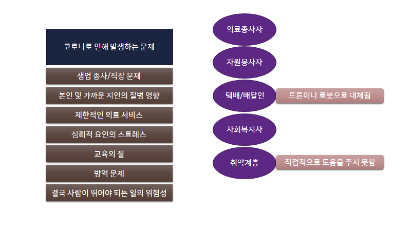
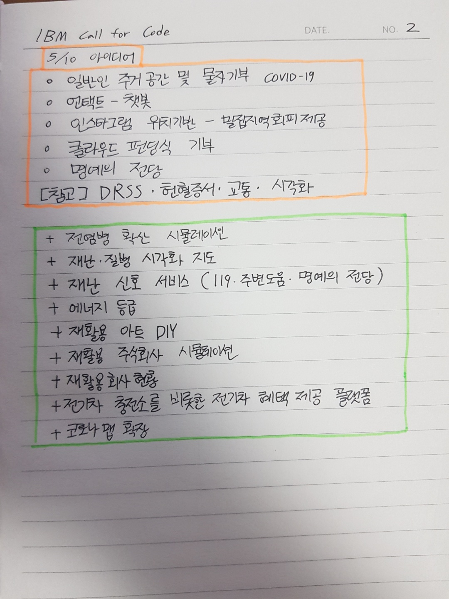
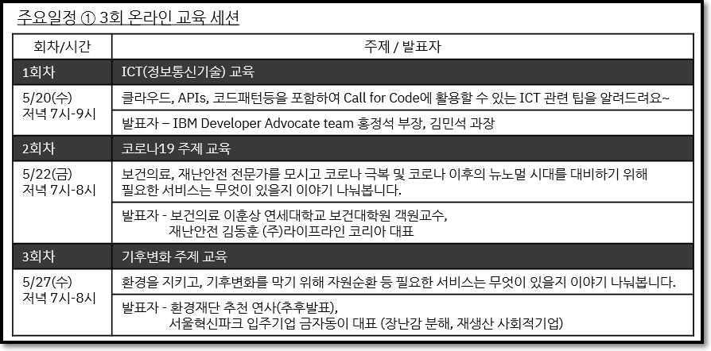
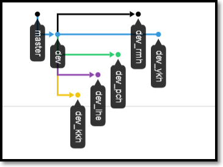
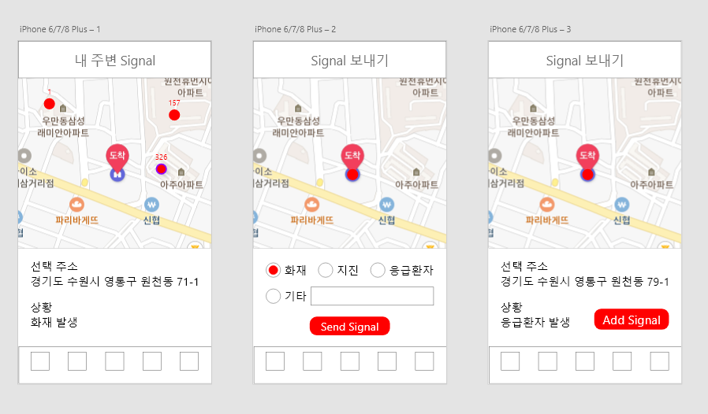

# Project.2020-CALL-FOR-CODE 👩‍💻👨‍💻

### [Save Our Signal] "위급 상황 도움 신호 서비스"

## 0. PROJECT INTRO

- 프로젝트 구성원 : [이민형](https://github.com/MinHyungRHIE), [박찬형](https://github.com/ch-4ml), [김경훈](https://github.com/ngngman), [이혜은](https://github.com/AliceHELee), [윤경호]()
- 프로젝트 일정
  - 해커톤 일정<br>
    

## 1. WHY : 본 프로젝트가 왜 의미가 있는가

- 개선하고자 하는 문제점 :
- 위 문제가 개선될 시 볼 효과 :

## 2. HOW : 어떻게 만들 생각인가

-

## 3. WHAT : 그래서 우리가 만든 결과물은

-

## 4. 마무리하면서

-

<hr>

## Activity Histroy

분위기 :
**Good**🟥🟧🟨🟩🟦🟪🟫**Bad**

### 🟨2020년 4월 23일(목)

- 서울시-한국IBM 온라인 해커톤 개최 소식을 접함 :
  [관련 소식](https://blog.naver.com/quotia72/221923628554)
- 팀원 구성 완료 (5명)
- 상호간 소개 및 인사 후 아이디어 논의 + 지금까지의 Call for Code 해커톤 수상작 및 Sample들을 살펴봄
- 코로나19와 환경문제에 대한 해결책 및 기존에 이미 존재하는 서비스들을 확인하며 개선해야 되는 부분이 있는지 긴 시간 토의함

### 🟩2020년 5월 8일(금)

- 첫 대면 미팅 진행 ( 장소 : _아주대 산학협력원_, **저녁 6시** )
  - 모임자 : 이민형, 박찬형, 김경훈, 이혜은 ( 윤경호는 회사 일로 바뻐서 아이디어 참가가 힘드므로 후에 설계가 나오고 기획이 세워지면 Front-End 개발 전 영역을 맡아주기로 함)
- 아이디어 회의 진행<br>
  

### 🟩2020년 5월 10일(일)

- 저녁 8시 50분, Google meet 화상 회의 진행 -> **아이디어 회의**

### 🟦2020년 5월 11일(월)

- 저녁 8시, Google meet 화상 회의 진행 -> **아이디어 회의**
- 아래 그림은 **5월 10일**, **5월 11일** 논의하면서 나온 쓸만한 아이디어 소스<br>
  

### 🟪2020년 5월 12일(화)

- !!! 오늘만은 꼭 아이디어를 정하자 !!! 제발...😭
- 저녁 8시 50분, Google meet 화상 회의 진행 -> **아이디어 회의**
- 결국 아이디어 못정함. 일단 참가 신청이라도 해야하니 우선 모든 아이디어를 적어보기로 함

### 🟪2020년 5월 13일(수)

- 해커톤 참가 신청 완료

```
<프로젝트 요약 및 아이디어>

위기의 지구를 구하는 Call for Code의 부름에 응답하기 위하여 저희 팀의 아이디어 후보는
1. 재난과 질병에 맞선 분들을 위한 신뢰 기반의 명예의 전당을 세워 그들을 위한 물자와 지원
2. 재난과 질병의 시각화 지도로 한눈에 볼 수 있게 하고 밀집 지역 회피를 위한 정보 제공
3. 재난 신호 서비스 : 119신고와 주변의 도움 요청을 통해 골든 타임 사수
4. 재활용 처리 현황 공유로 환경 경각심 유도 및 인공지능 개발을 통한 분리방법 안내시스템
```

### 🟩 온라인 교육 세션 진행(총 3 회)

<br>

- 1회차 내용 정리

```
1. IBM Cloud를 개인적으로 만들어야 하군요. 무료 서비스만으로도 충분할 것 같습니다.
2. "IBM의 서비스가 많으니 그걸 활용하라 0부터 만들기엔 시간이 없고, 그런걸 원하는 것도 아니다."
3. 지금까지 우승팀은 IoT팀(그러기에 우리는 모바일을 활용해 무언갈 하는 아이디어였으면 좋겠다)
4. 아이디어를 완전히 구현할 필요는 없고(시간이 부족) 어떻게 돌아가는지 DEMO 형식으로 보여주어 혁신성과 상용성 집중
5. Node-red 등의 IBM에서 제시한 기술 파악 필요 + Start Kit도 돌려봐야 할듯

[정리 한 줄]
IBM이 제시한 문제와 사례 기반으로 개발하면 좋곘고, 이미 관련 서비스가 있더라도 개선하는 방향으로 나아 갔으면 좋겠다.
```

- 2회차 내용 정리

```
코로나와 기후변화가 관계가 있다고 한다. 자가격리로 이동이 줄면서 환경이 크게 개선되었다는 것. 즉, 이동의 양을 줄이자.
인센티브가 필환경시대에서 참여를 유도할 것으로 보인다.
생산부터 재활용까지 기업이 책임지는 사례가 증가했으면 좋겠다.
시민 + 기업 + 정부 = 환경 문제 해결의 기본
```

- 3회차 내용 정리

```
저탄소 사회로의 전환, 기후변화 체계 확립(구체제: 교토의 정서, 새천년개발목표(MDGs) / 신체제: 파리협정, 지속가능발전목표(SDGs))
P4G, Partnering for Green Growth and the Global Goals 2030 : 포용성, 혁신성, 지속가능성
신기후체제의 확고한 확립 : 저탄소사회로의 전환은 불가피

플라스틱 장난감이 버려지면?
 - 플라스틱 장난감이 장난감으로 재활용되는 비율 0%
 - 한 해 평균 버려지는 플라스틱 장난감류의 양 240만톤
 - 버려진 장난감이 매립, 소각되는 비율 95%이상
 - 장난감 플라스틱이 분해되는 데 걸리는 시간 500년 이상
미세 플라스틱 문제도 발생하고 있다.
결국 이 문제들의 근본 : 돈
1kg 중고 플라스틱 가격 = 40원, 한시간에 80원, 하루 640원
해답 : 플라스틱 쓰레기의 가치를 높여라!!! ( Social Plastic Project )
ex) Smile Plastic, 장난감학교 쓸모, 슈퍼빈의 네프론 인공지능 쓰레기통
진정성과 다양함을 추구하자
```

### 🟦2020년 5월 29일(금)

- 저녁 8시, Google meet 화상 회의 진행 -> **아이디어**와 **팀**명 정함<br>

|      팀명       |         아이디어         |
| :-------------: | :----------------------: |
| Save Our Signal | 질병 및 재난 신호 서비스 |

- Slack Thread에 팀명과 아이디어 피드백

### 🟦2020년 5월 31일(일)

- 2020 Call for Code Korea Hackathon - 팀 구성 완료(5인팀 22번)
- 이메일 전송 : `최종팀명`, `팀구성원과 티셔츠 사이즈`, `티셔츠와 핏자 배송 팀대표 주소`, `참가주제`, `아이디어`
- 기술 선택 : Node.js - MongoDB

### 🟦2020년 6월 3일(수)

- Github 구축 -> Branch 구축<br>
  <br>
- 모든 팀 구성원 Collaborator 등록

### 🟫2020년 6월 4일(목) - 대격변

- 간단한 목표 정리<br>
  <br>
- 으아아... 실제로 설계하고 기획해보니 본 해커톤과 너무 멀어진 주제가... 😨<br>
  <br>
- 즉, 기후변화에 따라서 발생하게 되는게 재난인데, 재난에 너무 초점을 맞춰서 기후변화라는 핵심 주제에 많이 벗어났다는 것을 인지하게 됨😓
  <br>
- 우리가 추가한 기능 중 하나로, 스마트폰 이용 타이머를 설정해 심장 질환이 있거나 코로나 증상이 있는 사람이 만일 홀로 자가격리 중 문제가 발생하여 기절을 한다면 자동으로 주변으로 신호를 보내는 것이 주요 기능 중 하나(Save Our Signal)였는데, 문제는 집 주소를 정확히 알아야 주변 사람들이 도울 수 있다는 한계점이 있다...😷

  1. 첫째, 집 주소를 지도에 그대로 표시하기가 매우 부담스러움
  2. 둘째, 사람들이 코로나 환자인 것을 알게 된다면 과연 자진해서 도울까?

- 결국 아이디어를 갈아엎거나, 심하면 해커톤 포기까지 생각함. 🥵
- 조 구성원 모두 대학원 과제들과 프로젝트들로 지쳐있고 피곤한 상태, 해커톤을 포함한 모든 것을 6월 안에 끝내야하는 인간 한계 시험 현장😱
- 해커톤 준비 시작부터 지금까지 아이디어 문제로 제대로 풀리지도 않았고, 우리라면 쓰지도 않을 서비스를 억지로 만들기는 정말 싫었다.😟
- 결국 코로나19 확산 방지를 위해 사람들이 건물을 들어갈 때마다 위치 추적으로 확인하여 후에 확진자 발생 시 감염 경로 파악에 도움을 주자라는 이야기가 나옴
- 그런데 위치 추적+통신사 협력으로 구현하기엔 복잡하니 차라리 QR코드로 해보자<br>

🟩여기서 분위기 반전

- 정부의 QR코드 기반의 전자출입명부 시범 운영?
- 서울시?

### "이거다"

🟥 모두가 이구동성으로 정말 괜찮다고 동의하는 아이디어가 처음으로 나옴😅

- 기존 정부 QR코드 기반의 전자출입명부의 기능을 개선 및 추가하여 코로나19 확산을 더욱 효율적으로 막자!
- 기존에 나왔던 아이디어를 다 버리지는 않고 쓸만한 부분만을 가져오게 되었다.
- `AS-IS`

1. 출입자 수 시각화(실시간 지도)
2. 기관별 사람이 머무는 시간(관리자 작성)
3. 웨이팅 기능

- `TO-BE`

1. POS와 연동 가능성(퇴장 시간)
2. 사람이 머무는 시간 예측해서 사람 수 체크에 반영(머신러닝)

<br>

